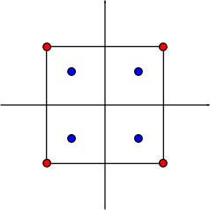

Custom element {#custom_element}
==============

[TOC]

Introduction {#gaussian_intro}
============

The purpose of this tutorial is to demonstrate how a custom element/field type can be introduced into the NiHu toolbox.

We define a custom 3-dimensional four noded quadrangle surface field.
The geometrical representation will be a standard 4-noded linear quadrilateral element (::quad_1_elem) having its nodes at the four element corners.
The field is going to be defined so that its shape function nodes are located at the Gaussian nodes of the element.
The new field is shown in the figure below.

In the following sections we define the new shape function set, introduce the new field type, and present an example how the new field type is used in a collocational or Galerkin type BEM.

The Gaussian shape set {#gaussian_shapeset}
======================

The Gaussian shape set is defined over the quadrilateral domain ::quad_domain located between coordinates \f$(-1,-1)\f$ and \f$(+1,+1)\f$.

The four nodal locations are

\f$\left(\xi_i,\eta_i\right) = \left(\pm\sqrt{3}/3, \pm\sqrt{3}/3\right)\f$

The shape functions are defined as

\f$L_1(\xi,\eta) = (1-\sqrt{3}\xi)(1-\sqrt{3}\eta)/4 \\
L_2(\xi,\eta) = (1+\sqrt{3}\xi)(1-\sqrt{3}\eta)/4 \\
L_3(\xi,\eta) = (1+\sqrt{3}\xi)(1+\sqrt{3}\eta)/4 \\
L_4(\xi,\eta) = (1-\sqrt{3}\xi)(1+\sqrt{3}\eta)/4\f$

and their derivatives with respect to both variables are

\f$L'_{1,\xi}(\xi,\eta) = (-\sqrt{3})(1-\sqrt{3}\eta)/4, \quad L'_{1,\eta}(\xi,\eta) = (1-\sqrt{3}\xi)(-\sqrt{3})/4 \\
L'_{2,\xi}(\xi,\eta) = (+\sqrt{3})(1-\sqrt{3}\eta)/4, \quad L'_{1,\eta}(\xi,\eta) = (1-\sqrt{3}\xi)(-\sqrt{3})/4 \\
L'_{3,\xi}(\xi,\eta) = (+\sqrt{3})(1+\sqrt{3}\eta)/4, \quad L'_{1,\eta}(\xi,\eta) = (1-\sqrt{3}\xi)(-\sqrt{3})/4 \\
L'_{4,\xi}(\xi,\eta) = (-\sqrt{3})(1+\sqrt{3}\eta)/4, \quad L'_{1,\eta}(\xi,\eta) = (1-\sqrt{3}\xi)(-\sqrt{3})/4\f$

The new shape function set will be termed `quad_1_gauss_shape_set`, and is introduced with a forward declaration:

\snippet custom_gaussian_element.hpp Forward declaration

Before defining the shape functions, we first define some basic properties of the shape function set by specialising the traits class template ::shape_set_traits to the new shape set as follows:

\snippet custom_gaussian_element.hpp Shape traits

- We have defined the shape set's domain as the ::quad_domain.
- The number of shape set nodes is 4.
- The polynomial order of the shape functions (the highest power of \f$\xi\f$ or \f$\eta\f$ in the definition of \f$L_i(\xi,\eta)\f$) is 1.
- The polynomial order of the Jacobian (the highest power of \f$\xi\f$ or \f$\eta\f$ in the product of the derivatives \f$L'_{\xi}\cdot L'_{\eta}\f$) is 1 too.

We mention here that the order of the Jacobian is only needed if the shape function set is used as a geometrical interpolation function set.
This will not be the case now, but we keep our code consistent with other shape function definitions.

After having the shape set traits defined, we can define the shape function class itself.
The new shape function class must be derived from the CRTP base ::shape_set_base.
This base class defines a general interface for all shape sets, including convenient type definitions of the variable vector \f$\xi\f$, shape function vector \f$L_i(\xi)\f$ and its gradient matrix \f$\nabla L_i(\xi)\f$.

The new derived class must define three static member functions.
- `eval_shape` evaluates the shape functions.
- `eval_dshape` evaluates the gradient of the shape functions.
- `corner_begin` returns a pointer to the first corner of the shape set.

\snippet custom_gaussian_element.hpp Shape class

The functions returning the shape function set and its derivatives are defined as

\snippet custom_gaussian_element.hpp Shape lsets

The shape function's nodal locations are stored in the static array `m_corners`. The `corner_begin` function returns the address of the array.

\snippet custom_gaussian_element.hpp Shape corners

That's all, we have defined the shape function set.
From now on, it can be used for geometrical interpolation or field interpolation purposes.
Furthermore, when using this shape function set in the collocational BEM context, the shape function nodes defined above are automatically used to generate weakly singular quadratures around the collocation points.

The field {#gaussian_field}
=========

The new field is going to be based on the standard ::quad_1_elem element, extended with our new shape function set.
The field will be termed `quad_1_gauss_field`, and is defined using a simple type definition:

\snippet custom_gaussian_element.hpp Field typedef

Each field type is automatically assigned an integer identifier.
However, we can override the field id definition by specialising the template structure (metafunction) ::field_id to our new field type

\snippet custom_gaussian_element.hpp Field id

The defined field id will be used in the function space definition matrix to distinguish between different kind of fields.

Our new field type is ready to use in collocational, Galerkin or general BEM methods.

Example {#gaussian_example}
=======

We present a simple example evaluating a collocational BEM with a function space based on `quad_1_gauss_field` fields.
The typedefs define the collcational BEM with a unity kernel and a homogeneous function space consisting of our new fields.
The main function builds a hand-made simple function space and evaluates the weighted residual.

\snippet gaussian_test.cpp main

