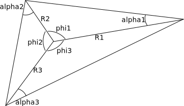

Customising singular integrals {#tut_custom_singular_integrals}
==============================

\page tut_custom_singular_integrals

[std::enable_if]:http://en.cppreference.com/w/cpp/types/enable_if

[TOC]

Introduction {#tut_custom_singular_integrals_intro}
============

This tutorial explains how to customise the evaluation of a singular integral in NiHu.
Our example of demonstration is the collocational singular integral of the 3D Helmholtz single layer potential kernel on a constant triangle element.

Theory {#tut_custom_singular_integrals_theory}
======

The singular integral {#tut_custom_singular_integrals_integrals}
---------------------

The collocational singular integral of the single layer potential kernel on a constant triangular element reads as

\f$
\displaystyle
L = \int_S \frac{\exp(-i k r)}{4\pi r}\mathrm{d}S_{\bf y}, \quad r = |{\bf y} - {\bf x}_0|
\f$

where \f$ {\bf x}_0 \f$ is the singular collocation point in the center of the element.

The method of static part subtraction {#tut_custom_singular_integrals_subtraction}
-------------------------------------

The integral \f$ L \f$ can be regularised by subtracting and adding its static \f$ k = 0 \f$ part:

\f$
\displaystyle
L =
L_0 + L_k =
\int_S \frac{1}{4\pi r}\mathrm{d}S_{\bf y} +
\int_S \frac{\exp(-ikr)-1}{4\pi r}\mathrm{d}S_{\bf y} =
\int_S \frac{1}{4\pi r}\mathrm{d}S_{\bf y} -
\frac{ik}{4\pi} \int_S \exp(-ikr/2) \mathrm{sinc}({kr/2}) \mathrm{d}S_{\bf y}
\f$

The dynamic part is clearly regular and can be integrated with a low order regular quadrature.
The static singular part can be evaluated analytically:

\f$
\displaystyle
L_0 = \frac{1}{4\pi}\sum_{i=1}^{3} R_i \sin \alpha_i \left[ \log\left(\frac{\tan{\frac{\phi_i+\alpha_i}{2}}}{\tan{\frac{\alpha_i}{2}}}\right) \right]
\f$

where \f$ R_i \f$ denotes the distance from the singular point to the \f$ i \f$-th corner of the triangle, and the angles \f$ \phi_i \f$ and \f$ \alpha_i \f$ are explained in the figure below:

The C++ code {#tut_custom_singular_integrals_cpp}
============

The singular integral shortcut {#tut_custom_singular_integrals_shortcut}
------------------------------

Singular integrals can be customised by specialising the class template ::singular_integral_shortcut for the specified singular integral type.

The class template is declared as
~~~~~~~~~~~~
template <class Kernel, class TestField, class TrialField, class Singulartiy, class Enable>
class singular_integral_shortcut;
~~~~~~~~~~~~
Where the parameters are
- **Kernel** the kernel type (::helmholtz_3d_SLP_kernel template in our case)
- **TestField, TrialField** the test and trial field types (both constant triangles, the test field is a Dirac-view because of the collocational approach)
- **Singularity** the singularity type (::singularity::face_match_type in our case)
- **Enable** an additional parameter to make complex type selection easy using the C++11 feature [std::enable_if]

Our specialisation is parametrised as follows
~~~~~~~~~~~~
template <class TestField, class TrialField>
class singular_integral_shortcut<
	helmholtz_3d_SLP_kernel<double>, TestField, TrialField, singularity::face_match_type,
	typename std::enable_if<
		std::is_same<typename get_formalism<TestField, TrialField>::type, formalism::collocational>::value &&
		std::is_same<typename TrialField::lset_t, tria_1_shape_set>::value &&
		std::is_same<typename TrialField::nset_t, tria_0_shape_set>::value
	>::type >
{
	// ...

public:
	template <class result_t>	// the result matrix type
	static result_t &eval(
		result_t &result,		// result matrix reference
		kernel_base<helmholtz_3d_SLP_kernel<double> > const &kernel,	// kernel instance (CRTP)
		field_base<TestField> const &,				// unused
		field_base<TrialField> const &trial_field,	// the trial field instance
		element_match const &)						// match data (unused for face_match)
	{
		// ...
	}
	
	//...
};
~~~~~~~~~~~~
The test and trial field types are left as template arguments of the specialisation, but they are used in the arguments of [std::enable_if] to select the appropriate specialisation case.
The specialisation is enabled if
- the formalism (deduced from the test and trial fields by the metafunction ::get_formalism) is ::formalism::collocational
- the geometrical interpolation function (L-set) of the trial field is ::tria_1_shape_set
- the field interpolation function (N-set) of the trial field is ::tria_0_shape_set

\note the test field does not need to be taken into account, as the ::singularity::face_match_type singulartiy implies that the test and trial element types are identical.

As shown above, the class specialisation defines a static public member function called `eval` that evaluates the singular integral into a result matrix received by reference as function argument.

Integrating the static part {#tut_custom_singular_integrals_static}
---------------------------

First we define a helper function `triangle_helper` that computes the radii \f$ R_i \f$ and the angles \f$ \alpha_i \f$ and \f$ \theta_i \f$ for a triangle element.
~~~~~~~~~~~
void triangle_helper(
	tria_1_elem const &elem,
	double r[],			// output radii
	double theta[],		// output angles
	double alpha [])	// output angles
{
	auto const &C_old = elem.get_coords();		// element vertices in columns
	auto const &x0 = elem.get_center();			// collocational point x0

	typename tria_1_elem::coords_t R, C;
	for (unsigned i = 0; i < 3; ++i)
	{
		R.col(i) = C_old.col(i) - x0;	// vector from x0 to corner
		r[i] = R.col(i).norm();			// distance
		R.col(i) /= r[i];				// normalise vector
		C.col(i) = C_old.col(i) - C_old.col((i+1) % 3);	// side vector
		C.col(i) /= C.col(i).norm();					// normalised
	}

	for (unsigned i = 0; i < 3; ++i)
	{
		theta[i] = acos(R.col(i).dot(R.col((i+1) % 3)));	// angle output
		alpha[i] = acos(R.col(i).dot(C.col(i)));			// angle output
	}
}
~~~~~~~~~~~

Using this helper function, the static part of the integral is computed in the member `eval` as follows:
~~~~~~~~~~~~~~~~
{
	auto const &elem = trial_field.get_elem();		// the element reference
	double r[3], theta[3], alpha[3];
	triangle_helper(elem, r, theta, alpha);	// compute R, theta, alpha

	for (unsigned i = 0; i < 3; ++i)				// evaluate analytical formula
		result(0,0) += r[i] * sin(alpha[i]) * log(tan((alpha[i]+theta[i])/2.) / tan(alpha[i]/2.));

	// integrate dynamic_part
	// ... to be discussed later
	//

	result(0,0) /= (4.0 * M_PI);

	return result;	// only the input argument reference is returned
}
~~~~~~~~~~~~~~~~

Integrating the dynamic part {#tut_custom_singular_integrals_dynamic}
----------------------------

For the numerical integration of the regular dynamic part, the class needs to store the quadrature points of a suitable regular quadrature.
The following static member quadrature is suitable:

~~~~~~~~~~~~~~
static gaussian_quadrature<tria_domain> const reg_quadrature(7) // 7-th order
~~~~~~~~~~~~~~
Class ::gaussian_quadrature<tria_domain> defines a Gaussian quadarture for a triangle domain.
The contructor takes the integration order as parameter.
The generated quadrature is able to integrate 7-th order polynomials on a triangle without error.
The quadrature is implemented as a container of quadrature points, and provides an iterator that traverses the quadrature points.
Using this quadrature, the dynamic part is integrated as
~~~~~~~~~~
std::complex<double> I_dyn = 0.0;
auto const &x0 = elem.get_center();					// element center
double k = kernel.get_data().get_wave_number();		// wave number
// traverse quadrature points
for (auto it = reg_quadrature.begin(); it != reg_quadrature.end(); ++it)
{
	double r = (elem.get_x(it->get_xi()) - x0).norm();	// distance from source
	I_dyn += dynamic_integrand(r, k) * it->get_w();		// integration
}
// multiply by Jacobian
I_dyn *= elem.get_normal(tria_domain::xi_t()).norm();
~~~~~~~~~~

where the function `dynamic_integrand` is implemented as
~~~~~~~~~~
static std::complex<double> dynamic_integrand(double const &r, double const &k)
{
	std::complex<double> const I(0.0, 1.0);	// imaginary unit
	return -I*k * exp(-I*k*r/2.) * sinc(k*r/2.);
}
~~~~~~~~~~

The final specialisation can be found in file library/helmholtz_singular_integrals.hpp

